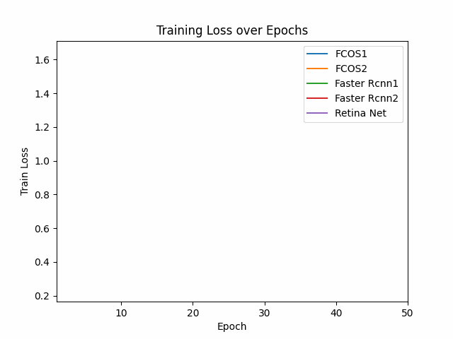
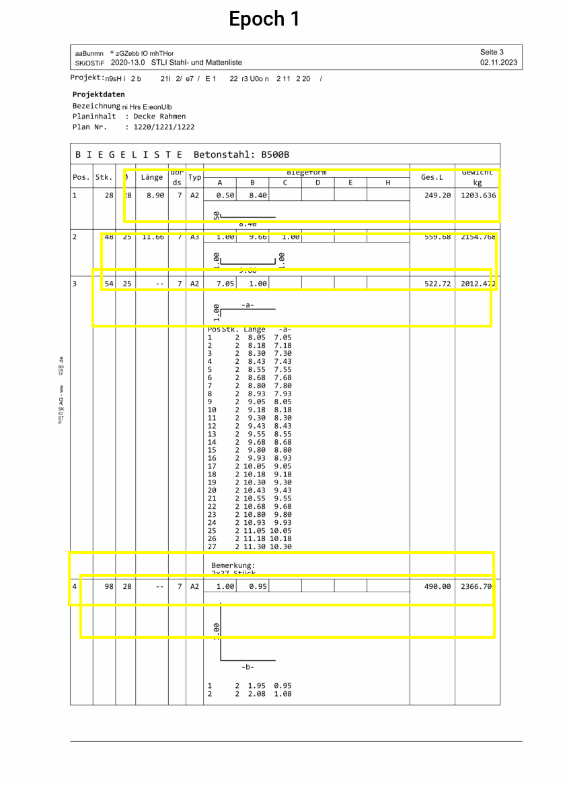
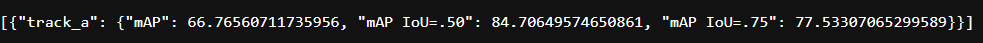

# Project Report

## Project Overview

This project aims to develop a modular object detection model using the CISOL dataset. Our objectives include:

1. **Model Optimization**: Experiment with various hyperparameters and architectures to fit the best possible model.
2. **Repository Integration**: Combine repositories and leverage the best predictions from multiple model runs conducted by participants.
3. **Result Ensembling**: Ensemble the results to improve detection accuracy.
4. **Leaderboard Submission**: Submit the most promising results to the EvalAI leaderboard.

## Ensembling strategies 

After experimenting with Non-Maximum Suppression (NMS), Weighted Box Fusion (WBF), and voting-based methods, we found that WBF consistently delivered superior precision in object detection. Here's why WBF stands out:

### Key Advantages of WBF:

1. WBF refines bounding boxes by averaging overlapping boxes weighted by confidence scores, enhancing accuracy compared to NMS.
2. By weighting based on confidence, WBF mitigates outlier impacts better than voting-based methods.
3. Merging boxes ensures uniformity, minimizing conflicts from independent voting-based detections.
4. WBF handles varying object scales and orientations better than NMS, which struggles with complex geometries.

### Challenges with Voting-Based and NMS Methods:
1. Voting treats all votes equally, amplifying outliers.
2. Integrating diverse model votes complicates final predictions.
3. NMS may miss closely spaced or partially occluded objects without careful IoU threshold tuning.

### Reasons for WBF's Superiority:
1. WBF averages contributions based on confidence, refining final outputs.
2. WBF considers confidence scores, enhancing detection reliability.
3. It smooths detection variations, providing stable results across scenarios.

### Enhanced WBF with Weighting Terms:
We further improved WBF by including weighting terms, allowing prediction files producing better mAP scores to be weighted more heavily than the rest. This approach achieved the best result with a mAP score of **56.77**.

## Repository Structure

```python
DLCV24-INDIVIDUAL-PROJECT
├── src
│   └── dlcv
│       ├── __pycache__
│       ├── __init__.py
│       ├── config.py        # Holds all configuration parameters
│       ├── dataset1.py      # Processes train data
│       ├── dataset2.py      # Processes test data
│       ├── inference.py     # Evaluates and builds JSON file for prediction on set data
│       ├── model.py         # Defines all models and their backbones
│       ├── plot.py          # Uses the saved training loss to make a plot
│       ├── train.py         # Uses configurable parameters and calls relevant functions for training the model
│       ├── training.py      # Contains the functionality for training with set epochs and saves training loss
│       ├── utils.py         # Holds all side functionalities necessary for training and evaluation
│       ├── visualize.py     # Uses the trained model to predict and visualize bounding boxes on test data
│       ├── ensemble.py     # Ensemble the predictions files saved using WBF with further addition of weights
│   ├── dlcv.egg-info
│   ├── __init__.py
├── .gitignore
├── individual-project.ipynb
├── pyproject.toml
├── README.md
└── setup.py
```

## Usage Instructions

### Run Instructions

To ensure a smooth run, please follow these instructions:

1. **Installation on Kaggle**: Use the provided script to install the necessary dependencies on Kaggle.
2. **Running Training and Inference**:
   - Execute `train.py` using the provided script. This will train the model.
   - Execute `inference.py` using the provided script. This will generate prediction files, each named according to the corresponding run.
3. **Running Ensemble**:
   - Execute `ensemble.py` using the provided script. This script will combine the results based on the specified weighted values.

The parameters required to achieve the mAP score of 56.77 are discussed in the Experimental Design section.

### Scripts

Script to run train.py

```python
import dlcv.train as train
import dlcv.config as config
cfg = config.get_cfg_defaults()

# Basic Customization
_C.TRAIN.RUN_NAME = "fasterrcnn"
cfg.TRAIN.BASE_LR = 0.004
cfg.TRAIN.WEIGHT_DECAY = 0.005
cfg.TRAIN.EPOCHS = 20
cfg.TRAIN.BATCH_SIZE = 2

# Model Selection
cfg.MODEL.TYPE = "fasterrcnn"
cfg.MODEL.BACKBONE = "resnet50"  

# Warmup options
cfg.TRAIN.WARMUP_LR = 0.0004
cfg.TRAIN.WARMUP_EPOCHS = 3

# Scheduling Options
cfg.TRAIN.PCT_START = 0.3
cfg.TRAIN.ANNEAL_STRATEGY = 'cos'

# Augmentation Techniques Values
cfg.TRAIN.HORIZONTAL_FLIP_PROB = 0.1
cfg.TRAIN.ROTATION_DEGREES = 3

train.main(cfg)
```

Script to run inference.py

```python
import dlcv.inference as inf
import dlcv.config as config
cfg = config.get_cfg_defaults()

# Basic Customization
cfg.TEST.SCORE_THRESHOLD = 0
cfg.TEST.IOU_THRESHOLD = 1
cfg.TEST.BATCH_SIZE = 10

cfg.MODEL.TYPE = "fasterrcnn"
cfg.MODEL.BACKBONE = "resnet50"

inf.main(cfg)
```

Script to run visualize.py

```python
import dlcv.visualize as vis
import dlcv.config as config
cfg = config.get_cfg_defaults()

# Basic Customization
cfg.TEST.SCORE_THRESHOLD = 0
cfg.TEST.IOU_THRESHOLD = 1
cfg.TEST.BATCH_SIZE = 10
cfg.MODEL.TYPE = "fasterrcnn"
cfg.MODEL.BACKBONE = "resnet50"

vis.main(cfg)
```

Script to run ensemble.py

```python
import dlcv.ensemble as ens
import dlcv.config as config
cfg = config.get_cfg_defaults()

# Basic Customization
cfg.ENSEMBLE.SCORE_THRESHOLD = 0
cfg.ENSEMBLE.IOU_THRESHOLD = 1
cfg.ENSEMBLE.USE_WBF = True
cfg.ENSEMBLE.FILENAME = ['fasterrcnn.json', 'retina.json', 'fcos.json', 'fasterrcnn1.json', 'fcos1.json']
cfg.ENSEMBLE.WEIGHTS = [2, 1, 1, 2, 1]

ens.main(cfg)
```

## Modular Design 

These are included inside config.py file
```python
 _C.MODEL = CN()
    _C.MODEL.NUM_CLASSES = 6
    _C.MODEL.TYPE = "fasterrcnn"  # 3 models available fasterrcnn, fcos and retinanet, with backbone resnet50
    _C.MODEL.BACKBONE = "resnet50"
```

## Hyperparameter Configuration

Inside the config.py, the important hyperparameters are:
```python
# Major Hyperparameters for fine-tuning train
    _C.TRAIN = CN()
    _C.TRAIN.RUN_NAME = "fasterrcnn"
    _C.TRAIN.BATCH_SIZE = 4
    _C.TRAIN.BASE_LR = 0.004
    _C.TRAIN.WEIGHT_DECAY = 0.005
    _C.TRAIN.NUM_EPOCHS = 20

    # Warmup Options
    _C.TRAIN.WARMUP_LR = 0.0004
    _C.TRAIN.WARMUP_EPOCHS = 1

    # Scheduling Options
    _C.TRAIN.PCT_START = 0.3
    _C.TRAIN.ANNEAL_STRATEGY = 'cos'

    # Train Data Augmentation Techniques
    _C.TRAIN.IMAGE_HEIGHT = 3509
    _C.TRAIN.IMAGE_WIDTH = 2480
    _C.TRAIN.HORIZONTAL_FLIP_PROB = 0
    _C.TRAIN.ROTATION_DEGREES = 0

    # Customizing evaluation on test data
    _C.TEST = CN()
    _C.TEST.SCORE_THRESHOLD=0
    _C.TEST.IOU_THRESHOLD=1
    _C.TEST.IMAGE_HEIGHT = 3509
    _C.TEST.IMAGE_WIDTH = 2480

    # Ensemble Configuration
    _C.ENSEMBLE = CN()
    _C.ENSEMBLE.SCORE_THRESHOLD = 0
    _C.ENSEMBLE.IOU_THRESHOLD = 0.7
    _C.ENSEMBLE.USE_WBF = True
    _C.ENSEMBLE.FILENAMES = ['fasterrcnn.json', 'retina.json', 'fcos.json', 'fasterrcnn1.json', 'fcos1.json']
    _C.ENSEMBLE.WEIGHTS = [2, 1, 1, 2, 1]
```

## Experimentation
### Experimental Design

This section summarizes all the experiments conducted according to the Usage Instructions section. Various hyperparameters and model architectures were tested across multiple group participants. From these experiments, the top 5 models were selected for ensembling based on their performance.

The evaluation of the results was primarily based on the mean Average Precision (mAP) metric.

Details of the model runs that were selected for ensembling are as follows:

### Key Experiments and Results

| Parameter               | Experiment 1 | Experiment 2 | Experiment 3 | Experiment 4 | Experiment 5      |
|-------------------------|--------------|--------------|--------------|--------------|-------------------|
| Model                   | RetinaNet    | FasterRCNN   | FCOS   | FasterRCNN   | FCOS              |
| Backbone                | ResNet50     | ResNet50     | ResNet50     | ResNet18     | ResNet18          |
| Learning Rate           | 0.004        | 0.004        | 0.004        | 0.004        | 0.0008            |
| Weight Decay            | 0.005        | 0.005        | 0.005        | 0.0005       | 0.00011           |
| Epochs                  | 30           | 50           | 30           | 80           | 40                |
| Batch Size              | 2            | 2            | 2            | 20           | 2                 |
| Warmup                  | None         | None  | None | None         | None              |
| Augmentations           | None         | None | None | None         | None              |
| Other parameters        | Default Config.py | Default Config.py | Default Config.py | Default Config.py          | Default Config.py |
| Results (mAP)           | 49.6         | 56.95        | 23.9        | 55.17        | 29.38             |

#### Ensembling Weights:

1. Weight of experiment 1 results: 2
2. Weight of experiment 2 results: 1 
3. Weight of experiment 3 results: 1
4. Weight of experiment 4 results: 2
5. Weight of experiment 5 results: 1

#### Train-loss Plot Combined

During each model run, the training loss was plotted to monitor the training progress. For the best models used in the ensembling process, an animation of the training loss plots has been added to illustrate the training dynamics more clearly. This animation helps in understanding how the training loss evolved over time for these top-performing models.



#### Visualisation on Test Data

The following animation is created for the best model, Faster R-CNN with a ResNet-50 backbone. It visualizes how the predicted bounding boxes improve over increasing epochs, providing a clear understanding of the model's learning process and refinement of predictions over time.



## EvalAI Leaderboard Submissions

The mAP Score from ensembling the results from the models can be seen in the following submission image retrieved from EvalAI. 



## Conclusion

The project successfully developed a modular and customizable object detection framework. Through extensive experimentation, it was concluded that ensembled results of FasterRCNN, FCOS and RetinaNet using modular backbones gave the best mAP score of **56.77**.
